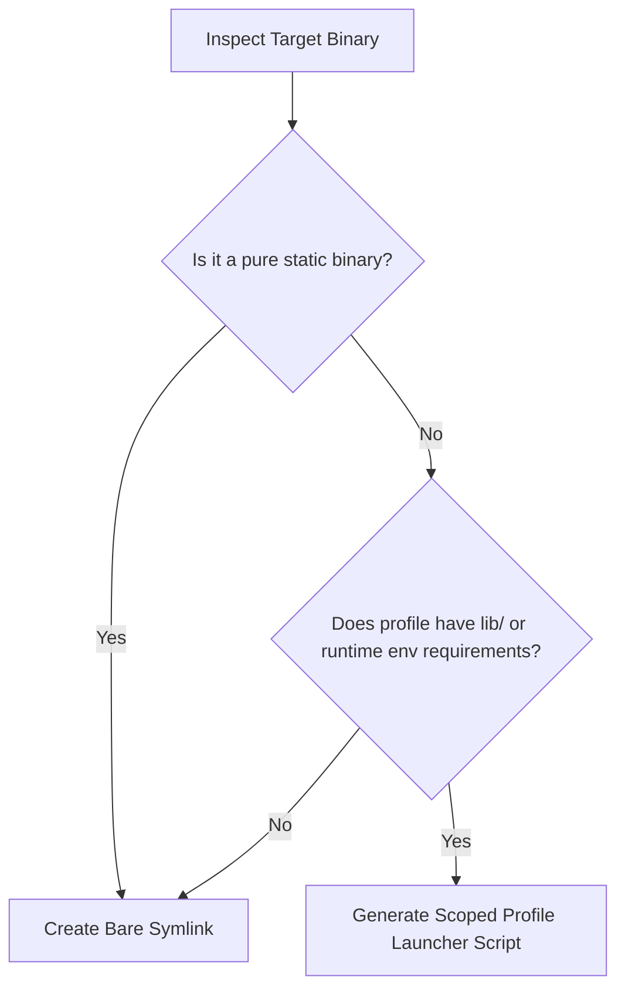

# Rootless Execution Model

> **Historical baseline.** The command-local, evidence-based execution contract
> in [Rootless Execution: Verified Environments per Command](rootless-execution-counter-proposal.md)
> is the current implementation direction. The generic profile-wide launcher
> examples below remain for comparison and are not a support claim until they
> are reconciled with that counter-proposal's acceptance gates.

This document establishes the architecture for running foreign, distribution-packaged Linux applications (`.deb`, `.rpm`, `.pkg.tar.zst`) in an unprivileged, isolated user-space store without `sudo`, root namespaces, or container runtimes.

---

## 1. Problem Statement & Mission

Traditional Linux package managers (`apt`, `dnf`, `pacman`) operate under two foundational assumptions:
1. The package manager runs as `root` with total write access to `/`.
2. All packages share a global Filesystem Hierarchy Standard (FHS) root (`/usr/bin`, `/usr/lib`, `/etc`, `/usr/share`).

`pkg` intentionally breaks both assumptions to achieve rootless installation, isolated environments, and coexistence with native system managers without host pollution ([INV-001](file:///home/brasga/projects/pkg/context/project/invariants.md), [INV-002](file:///home/brasga/projects/pkg/context/project/invariants.md)).

However, foreign distribution packages contain binaries and scripts compiled or written with hardcoded expectations of `/`. Rather than reacting to runtime errors ad-hoc, `pkg` defines a **systematic rootless adaptation pipeline**.

---

## 2. The 5 Friction Vectors of Rootless Execution

Every package installed by `pkg` must pass through five distinct adaptation layers:

```text
  Foreign Artifact (.deb / .rpm / .pkg.tar.zst)
                     │
                     ▼
  ┌─────────────────────────────────────────────────────────────┐
  │ Layer 1: Extraction & Symlink Caging                        │
  │   - Sanitize relative & absolute symlinks                   │
  │   - Relativize absolute targets against package root        │
  │   - Reject traversal and escaping links (INV-004)           │
  └──────────────────────────────┬──────────────────────────────┘
                                 │
                                 ▼
  ┌─────────────────────────────────────────────────────────────┐
  │ Layer 2: Staging-Time Text Relocation                       │
  │   - Index bundled FHS components (PackageFhsIndex)          │
  │   - Rewrite bundled paths in scripts, .desktop, units       │
  │   - Materialize default configuration templates (.ucf)      │
  │   - Preserve host paths and shebangs untouched              │
  └──────────────────────────────┬──────────────────────────────┘
                                 │
                                 ▼
  ┌─────────────────────────────────────────────────────────────┐
  │ Layer 3: Store Promotion & Shared Library Indexing          │
  │   - Atomic move staging -> store/<store-id>                 │
  │   - Symlink shared libraries into profile/lib/              │
  │   - Record metadata and checksums in SQLite                 │
  └──────────────────────────────┬──────────────────────────────┘
                                 │
                                 ▼
  ┌─────────────────────────────────────────────────────────────┐
  │ Layer 4: Profile Binary Activation & Launcher Generation    │
  │   - Determine if bare symlink or wrapper is required        │
  │   - Generate deterministic, scoped launcher scripts         │
  │   - Atomically switch links in profile/bin/                 │
  └──────────────────────────────┬──────────────────────────────┘
                                 │
                                 ▼
  ┌─────────────────────────────────────────────────────────────┐
  │ Layer 5: Execution-Time Runtime Scoping                     │
  │   - Dynamic linker resolution (LD_LIBRARY_PATH to profile)  │
  │   - Framework discovery (PYTHONPATH, R_HOME, PERL5LIB)      │
  │   - XDG data discovery (XDG_DATA_DIRS to profile/share)     │
  └─────────────────────────────────────────────────────────────┘
```

---

### Vector 1: Dynamic Linker & Shared Libraries (ELF)

#### The Problem
ELF binaries declare dynamic dependencies via `DT_NEEDED` entries (e.g. `NEEDED libblas.so.3`). When executed, the kernel dynamic linker (`/lib64/ld-linux-x86-64.so.2`) searches:
1. `DT_RPATH` / `DT_RUNPATH` embedded inside the binary;
2. Directories in the `$LD_LIBRARY_PATH` environment variable;
3. Global system cache (`/etc/ld.so.cache`), typically `/lib` and `/usr/lib`.

When `pkg` installs a dependency (e.g. `libblas3`), it places the library into `store/<store-id>/usr/lib/...` and symlinks it into `profiles/<name>/lib/`. The system linker cannot discover `profiles/<name>/lib/` without intervention.

#### Architectural Solution: Profile Launcher Wrappers
Instead of creating bare symlinks from `profiles/<name>/bin/<cmd>` to the store binary, `pkg` generates a **lightweight launcher script** whenever the command or profile requires library/runtime scoping:

```bash
#!/bin/sh
# Generated by pkg for command: R
PROFILE_DIR="$(dirname "$(dirname "$0")")"
export LD_LIBRARY_PATH="${PROFILE_DIR}/lib${LD_LIBRARY_PATH:+:$LD_LIBRARY_PATH}"
exec "/home/user/.local/share/pkg/store/<store-id>/usr/bin/R" "$@"
```

#### Why Wrappers over `patchelf` (RPATH Patching)
1. **Cryptographic Integrity:** Modifying ELF headers invalidates package checksums and risks corrupting binaries across diverse architectures (x86_64, aarch64, riscv64).
2. **Portability:** Shell wrappers run on any POSIX system with zero third-party C library dependencies.
3. **Reversibility:** Wrappers live strictly in `profiles/<name>/bin/`. The store payload remains completely immutable and reproducible.

---

### Vector 2: Hardcoded FHS Paths in Scripts and Text Files

#### The Problem
Scripts and configurations hardcode paths like:
- `bootstrap=/usr/share/discord/updater_bootstrap`
- `sys.path.insert(0, "/usr/share/virt-manager")`
- `ExecStart=/usr/bin/reflector @/etc/xdg/reflector/reflector.conf`

#### Architectural Solution: Two-Phase Relocation
1. **`PackageFhsIndex` Validation:** During staging, `pkg` inspects all relative paths extracted in the payload. It only rewrites `/usr/share/<name>`, `/usr/lib/<name>`, `/etc/<name>`, `/opt/<name>`, etc., **if and only if** `<name>` is bundled in the package payload.
2. **Selective Substitution:**
   - Shebang lines (`#!...`) are strictly preserved.
   - Host inspection calls (e.g. `cat /etc/os-release`, `cat /etc/passwd`, `/usr/bin/env`) are preserved.
   - Path assignments without delimiters are relocated to `{target_store_dir}`.

---

### Vector 3: Symlink Topology & Caging

#### The Problem
Debian Policy §10.5 recommends that symlinks crossing top-level directories (such as from `/usr` to `/etc`) must be absolute (e.g. `usr/lib/R/etc/Makeconf -> /etc/R/Makeconf`). In a rootless store, extracting an absolute symlink as-is causes it to either point to non-existent host paths or leak into host files outside the store.

#### Architectural Solution: Universal Symlink Sanitization (`sanitize_symlink_target`)
All format adapters (`deb`, `rpm`, `alpm`) pass symlinks through `sanitize_symlink_target`:
1. Absolute targets are normalized relative to the package payload root (treating the store object as the logical `/`).
2. The relative offset between the entry's parent directory and the target is calculated (e.g. `usr/lib/R/etc/Makeconf` -> `../../../../etc/R/Makeconf`).
3. If any target tries to escape the store root (e.g. `/../../etc/shadow`), it is rejected with `SecurityViolation` ([INV-004](file:///home/brasga/projects/pkg/context/project/invariants.md)).
4. The materialized symlink is strictly relative on disk, permanently caging the link inside the isolated store.

---

### Vector 4: Runtime Environment Scoping

#### The Problem
Interpreted languages and runtime environments rely on environment variables to locate standard libraries and site packages:

| Ecosystem | Variable | Target Store Directory |
|---|---|---|
| **Python** | `PYTHONPATH` | `usr/lib/pythonX.Y/site-packages`, `usr/lib/pythonX.Y/dist-packages` |
| **R** | `R_HOME` | `usr/lib/R` |
| **Perl** | `PERL5LIB` | `usr/share/perl5`, `usr/lib/x86_64-linux-gnu/perl5` |
| **Ruby** | `GEM_PATH` | `usr/share/rubygems-integration` |
| **Node.js** | `NODE_PATH` | `usr/lib/node_modules` |
| **Desktop / GTK / Qt** | `XDG_DATA_DIRS` | `profiles/<name>/share:/usr/local/share:/usr/share` |

#### Architectural Solution: Automatic Runtime Detection
`pkg` inspects payload directories during staging:
- If `dist-packages` or `site-packages` exists, the launcher exports scoped `PYTHONPATH`.
- If `usr/lib/R` exists, the launcher exports scoped `R_HOME`.
- In Milestone 4 (Desktop Integration), all GUI launchers export `XDG_DATA_DIRS` pointing to the profile `share/` directory.

---

### Vector 5: Configuration Files & Default-Deny Compensation

#### The Problem
Under [INV-003](file:///home/brasga/projects/pkg/context/project/invariants.md) and [ADR-011](file:///home/brasga/projects/pkg/context/adr/ADR-011-maintainer-scripts-default-deny.md), package lifecycle scripts (`postinst`, `%post`) are default-deny. On Debian systems, tools like `ucf` copy template configurations (`*.ucf`, `*.default`) into `/etc` during `postinst`. Without maintainer scripts, essential configuration files are missing.

#### Architectural Solution: Template Materialization
During the staging phase:
1. When a template configuration file is detected (e.g. `usr/lib/R/etc/Renviron.ucf` or `*.default`), `pkg` checks whether the target configuration in `{staging}/etc/...` is absent.
2. If absent, `pkg` copies the template into place before text relocation runs.
3. This provides complete default functionality without executing untrusted maintainer scripts.

---

## 3. Launcher Classification & Generation Matrix

When activating a package into a profile (`profiles/<name>/bin/<command>`), `pkg` evaluates the following decision matrix:



### Launcher Script Template
```bash
#!/bin/sh
# Generated by pkg for: <command>
# Package: <package-name> (<version>)
# Store object: <store-id>

# 1. Resolve Profile Root
PROFILE_BIN_DIR="$(CDPATH= cd -- "$(dirname -- "$0")" && pwd)"
PROFILE_DIR="$(dirname "$PROFILE_BIN_DIR")"

# 2. Inject Shared Libraries
if [ -d "$PROFILE_DIR/lib" ]; then
    export LD_LIBRARY_PATH="$PROFILE_DIR/lib${LD_LIBRARY_PATH:+:$LD_LIBRARY_PATH}"
fi

# 3. Inject XDG Data Dirs (Desktop Integration)
if [ -d "$PROFILE_DIR/share" ]; then
    export XDG_DATA_DIRS="$PROFILE_DIR/share:${XDG_DATA_DIRS:-/usr/local/share:/usr/share}"
fi

# 4. Inject Runtime-Specific Variables
<RUNTIME_ENV_EXPORTS>

# 5. Execute Target Binary
exec "<TARGET_STORE_BINARY>" "$@"
```

---

## 4. Invariant Compliance Checklist

- [x] **INV-001 (No native DB mutation):** Everything operates in user `$HOME`.
- [x] **INV-002 (Never extract to `/`):** Store objects reside in `~/.local/share/pkg/store`.
- [x] **INV-003 (Default-deny lifecycle scripts):** Configs materialized via templates, not arbitrary shell scripts.
- [x] **INV-004 (Path traversal rejection):** Symlinks relativized and verified never to pop above root.
- [x] **INV-006 (Store vs Activation):** Store payloads remain pristine; launchers/symlinks live only in profiles.
- [x] **INV-010 (Side-effect free planning):** Launchers and links are calculated during planning and materialized only in the transaction activation phase.
- [x] **INV-014 (Ownership-based removal):** Uninstall cleanly unlinks launchers and deactivates library symlinks.
